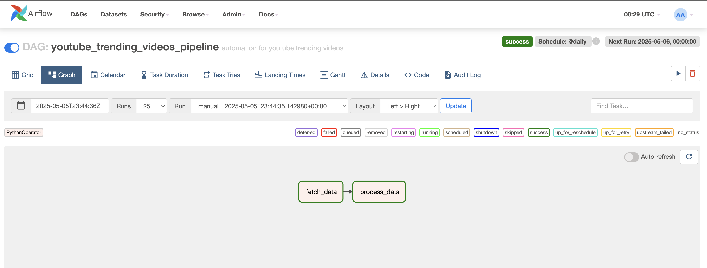

# YouTube Trending Data Pipeline and Dashboard

This project presents a complete end-to-end data engineering and visualization solution that extracts trending YouTube video data daily, processes it using AWS Athena, orchestrates data workflow with Apache Airflow, and presents the results on a sleek React-based dashboard.

## Table of Contents

- [Project Overview](#project-overview)
- [Tech Stack](#tech-stack)
- [1. Data Extraction (Airflow)](#1-data-extraction-airflow)
- [2. Data Storage and Querying (S3 & Athena)](#2-data-storage-and-querying-s3--athena)
- [3. Backend API (AWS Lambda + API Gateway)](#3-backend-api-aws-lambda--api-gateway)
- [4. Frontend Dashboard (React)](#4-frontend-dashboard-react)
- [Screenshots](#screenshots)
- [How to Run](#how-to-run)

## Project Overview

The goal of this project is to fetch daily YouTube trending data, store it in a structured format, make it queryable via AWS Athena, and visualize the trending results for any selected date using a React frontend.

## Tech Stack

- **Data Orchestration:** Apache Airflow
- **Storage:** AWS S3
- **Query Engine:** AWS Athena
- **Serverless Backend:** AWS Lambda + API Gateway
- **Frontend:** React (CSS only, no external UI libraries)
- **Data Source:** YouTube API

## 1. Data Extraction (Airflow)

- **Step 1:** Created an Airflow DAG that runs daily.
- **Step 2:** The DAG uses PythonOperator to fetch trending data from a youtube API.
- **Step 3:** Uploaded to S3 in a json format.

## 2. Data Storage and Querying (S3 & Athena)

- **S3 Bucket Setup:**

  - Bucket Name: `athena-output-query-result`
  - Data files uploaded in folders based on `timestamp`.

- **Athena Table Definition:**

  - Created a table named `youtube_trending_data`.

## 3. Backend API (AWS Lambda + API Gateway)

- **Lambda Function:**

  - Accepts a `date` parameter.
  - Executes Athena query to retrieve data for the selected date.
  - Formats and returns JSON.

- **API Gateway Setup:**

  - Exposed Lambda as a REST API endpoint.
  - Endpoint Example: `https://khout2ucs4.execute-api.us-east-1.amazonaws.com/prod/query?date=YYYY-MM-DD`

## 4. Frontend Dashboard (React)

- **React App Setup:**

  - Used `create-react-app`.
  - Simple and clean UI using custom CSS.

- **Features:**

  - Date Picker for selecting date.
  - Cards for each trending video result with:

    - Thumbnail
    - Title
    - Channel Name
    - Published Date
    - View, Like, and Comment Counts

  - Each card links to the actual YouTube video.

## Screenshots

```md



```

## Live Demo

You can view the live, interactive dashboard here:  
👉 **[YouTube Trending Dashboard – Live Site](https://bikram48.github.io/youtube_trending_ui/)**  
Hosted on **GitHub Pages**.

## How to Run

### ✅ Prerequisites

- AWS Account (with access to S3, Athena, Lambda, API Gateway)
- Airflow installed locally
- Node.js + npm for frontend

### 🔧 Setup Steps

1. **Airflow:**

   - Clone the repo and place the DAG in your Airflow DAGs folder.
   - Start Airflow scheduler and web server.

2. **S3:**

   - Create the required bucket and configure policies if needed.

3. **Athena:**

   - Create the table using the schema and point to the correct S3 location.

4. **Lambda:**

   - Paste the provided Python code.
   - Add permissions for S3, Athena, and CloudWatch.

5. **API Gateway:**

   - Create a REST API, enable CORS, and connect it to your Lambda.

6. **Frontend:**

   ```bash
   npm install
   npm start
   ```

   - Update `API_URL` in your React code to your deployed API endpoint.
